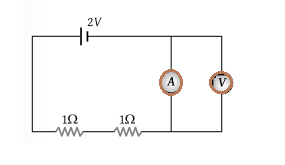

## Post test
#### Please attempt the following questions

Q1. KVL is related to - 

 A. Junction current   
 B. Battery e.m.fs   
 C. IR Drop   
 D. Both B & C   

Q2. According to Kirchhoff’s voltage law, the algebraic some of all IR drops and e.m.fs. in any closed of a network is always - 

 A. Negative  
 B. Positive  
 C. Determined by battery e.m.fs.  
 D. Zero   

Q3. Kirchhoff’s law valid for - 

 A. Linear circuit only 
 B. Passive time invariant circuits 
 C. Nonlinear circuits only 
 D. Both linear and nonlinear circuits only 

Q4.  Mesh analysis is based on - 

 A. Kirchhoff’s voltage law  
 B. Kirchhoff’s current law 
 C. Law of conservation of momentum 
 D. Law of conservation of energy 

Q5. A super mesh is created if - 

 A. A voltage source is common to two loops  
 B. A current source is common to two loops  
 C. A current source is common to two nodes  
 D. A voltage source is common to two nodes  

Q6. What is the internal resistance of voltage source and voltmeter? 

 A. Zero, infinity  
 B. Infinity, zero  
 C. infinity, infinity  
 D. Zero, zero  

Q7.  What is reading of voltmeter?  
      

 A. 2V  
 B. 1V  
 C. 0.5V  
 D. 0V  
 
Q8. Connection of voltmeter and ammeter in any circuit - 

 A. Shunt and series with resistance  
 B. Series and shunt with resistance  
 C. Both are in series   
 D. Both are in shunt   

Q9. Current I=? 

 A. -0.5A  
 B. 0.5A  
 C. -0.2  
 D. 0.2A  

Q10. What is the voltage across 5ohm resistor if current source has current 17/3 A ? 

 A. 2.23A   
 B. 5.31A  
 C. 2.32A  
 D. 8.96A  

