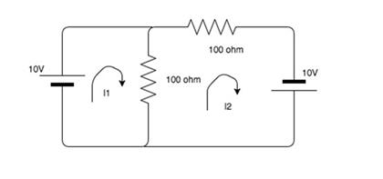
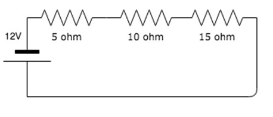

## Pre test
#### Please attempt the following questions

<b>Q1. KVL deals with the conservation of-</b> 

A   Mass 
B   Momentum 
C   Charge 
D   Energy  

<b>Q2. The algebraic sum of the voltages over any closed loop is equal to-</b> 

A   0V  
B   Infinity 
C   1V 
D   2V  

<b>Q3. What is the basic law that has to be followed in order to analyze the circuit?</b> 

A  Newton's Law 
B  Faraday's Law 
C  Ampere's Law 
D  Kirchhoff's Law  

<b>Q4. Every __________ is a______ but every _____ is not a ______-</b> 

A  Mesh, loop, loop, mesh 
B  Loop, mesh, mesh, loop 
C  Loop, mesh, loop, mesh 
D  Mesh, loop, mesh, loop  

<b>Q5. KVL is applied-</b> 

A  Node 
B  Mesh 
C  Loop 
D  Both loop & mesh  

<b>Q6. AC and DC both types of circuit can use kirchhoff’s law-</b>

A   True 
B   False  

<b>Q7. KVL is generally used for-</b> 

A  Voltage 
B  Current 
C  Resistance 
D  Power  

<b>Q8.  Find the value of currents I1 & I2-</b> 

A  0.3A,0.1A 
B  -0.1A,-0.3A 
C  -0.3A,-0.1A 
D  0.1A,0.2A  

<b>Q9. Potential difference in a circuit is also called as____?</b>  

A Voltage difference  
B Electric pressure  
C Electric tension  
D All of the above   

<b>Q10. Calculate the voltage across 10 ohm resistor-</b> 

A  12V 
B  4V 
C  10V  
D  0V  
