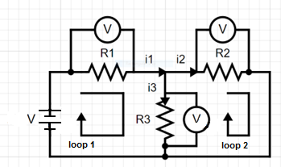
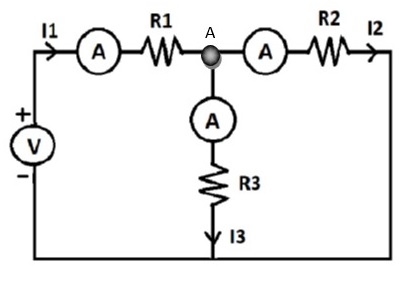

### Introduction:
“Kirchhoff’s Voltage Law (The Loop Rule) states that around any closed loop or path in a circuit, the algebraic sum of all electric potential differences is equal to zero.” 

This law is also called “kirchhoff’s second law”  

When the current passes through the resistor, there is a loss in energy and therefore a voltage drop. Kirchhoff’s voltage law.  

 $ ∑Vi = 0  $ 

 
Fig. 1: Circuit Diagram to demonstrate Kirchoff's Voltage law
  

In any circuit, voltage drops across the resistors have opposite polarities to the source polarity.  
Remember that when traveling around the circuit to apply Kirchhoff's Voltage Law, be sure you are always going in the same direction (clockwise or counterclockwise) to determine whether a given element represents an increase or decrease in the voltage. If you begin jumping around, moving in different directions, your equation will be When crossing a resistor, the voltage change is determined by the ohm’s law…   

 $ V=I⋅R $ 

where I is the value of the current and R is the resistance of the resistor. Crossing in the same direction as the current means the voltage goes down, so its value is negative. When crossing a resistor in the direction opposite the current, the voltage value is positive, so it is increasing.  

In given figure there are two loop. Acc. to Kirchhoff’s voltage law……. 

 $ V − V_{R1} − V_{R3} = 0  $  

             

 $  V −  i1R1 − i3R3 = 0 ..........(1) $ 

 $ V_{R2} + ( − V_ {R3}) = 0  $ 

 $ i2R2 + (− i3R3) = 0............(2)  $  

#### Advantages of Kirchhoff’s Law  
1. Kirchhoff’s Law can easily calculate unknown currents and voltages. 

2. The analysis and simplification of complex closed-loop circuits become manageable.  

#### Disadvantages of Kirchhoff’s Law  

1. Kirchhoff’s rules work on the assumption that the closed loop has no fluctuating magnetic fields. Under the influence of a fluctuating magnetic field, electric fields and electromotive force can be created, causing in Kirchhoff’s rule to be broken.  

### Introduction:

Kirchhoff’s Current Law or KCL, states that the “total current or charge entering a junction or node is exactly equal to the charge leaving the node as it has no other place to go except to leave, as no charge is lost within the node". 

It is also called as Kirchhoff's first law, Kirchhoff's point rule, or Kirchhoff's junction rule (or nodal rule).  

This law represents a mathematical statement of the fact that charge cannot accumulate at a node. A node is not a circuit element, and it certainly cannot store, destroy, or generate charge. Hence, the currents must sum to zero. We can use hydraulic analogy here to understand better: for example, let’s consider three water pipes joined in the shape of a Y. We define three water currents as flowing into each of the three pipes. If we insist that water is always flowing, then obviously we cannot have three positive water currents, or the pipes would burst. This is a result of our defining currents independent of the direction that water is actually flowing. Therefore, the value of either one or two of the currents as defined must be negative.  

Summarizing,  

“The algebraic sum of all currents entering and exiting a node must equal zero” Mathematically,   

 $ ∑ I_{IN} = ∑ I_{OUT}  $ 

KCL can be viewed as an extension of the conservation of charge, since charge is the product of current and the time the current has been flowing in the circuit.
Kirchhoff’s Current Law is applicable to any lumped parameter electrical circuit.  

### CIRCUIT DIAGRAM:

 
Fig. 2: Circuit Diagram to demonstrate Kirchhoff's Current law 
  

Applying KCL at node,  

 $ −I1 + I2 + I3=0 $ 

 $ I1 = I2 + I3  $ 

In the above equation, the left-hand side represents the sum of entering currents, whereas the right-hand side represents the sum of leaving currents. Here we will consider positive sign when current leaves a node and negative sign when it enters a node. Similarly, you can consider negative sign when the current leaves a node and positive sign when it enters a node. In both cases, the result will be same. KCL is independent of the nature of network elements that are connected to a node.  

### Advantages of Kirchhoff’s Law

1. Kirchhoff’s Law can easily calculate unknown currents and voltages.

2. The analysis and simplification of complex closed-loop circuits become manageable.

### Disadvantages of Kirchhoff’s Law 

1. Kirchhoff’s rules work on the assumption that the closed loop has no fluctuating magnetic fields. Under the influence of a fluctuating magnetic field, electric fields and electromotive force can be created, causing in Kirchhoff’s rule to be broken.

