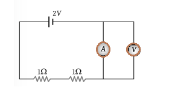
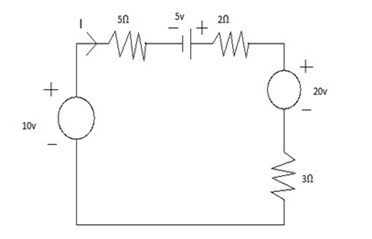

## Post test
#### Please attempt the following questions

<b>Q1. KVL is related to-</b> 

 A. Junction current   
 B. Battery e.m.fs   
 C. IR Drop   
 C. Both B & C   

<b>Q2. According to Kirchhoff’s voltage law, the algebraic some of all IR drops and e.m.fs. in any closed of a network is always-</b> 

 A. Negative  
 B. Positive  
 C. Determined by battery e.m.fs.  
 D. Zero   

<b>Q3. Kirchhoff’s law valid for-</b> 

 A. Linear circuit only 
 B. Passive time invariant circuits 
 C. Nonlinear circuits only 
 D. Both linear and nonlinear circuits only 

<b>Q4.  Mesh analysis is based on-</b> 

 A. Kirchhoff’s voltage law  
 B. Kirchhoff’s current law 
 C. Law of conservation of momentum 
 D. Law of conservation of energy 

<b>Q5. A super mesh is created if-</b> 

 A. A voltage source is common to two loops  
 B. A current source is common to two loops  
 C. A current source is common to two nodes  
 D. A voltage source is common to two nodes  

<b>Q6. What is the internal resistance of voltage source and voltmeter?</b> 

 A. Zero, infinity  
 B. Infinity, zero  
 C. Zero, infinity  
 D. Zero, zero  

<b>Q7.  What is reading of voltmeter?</b>  

 A. 2V  
 B. 1V  
 C. 0.5V  
 D. 0V  
 

<b>Q8. Connetion of voltmeter and ammeter in any circuit-</b> 

 A. Shunt and series with resistance  
 B. Series and shunt with resistance  
 C. Both are in series   
 D. Both are in shunt   

<b>Q9. Current I=?</b>

 A. -0.5A  
 B. 0.5A  
 C. -0.2  
 D. 0.2A  

<b>Q10. What is the voltage across 5ohm resistor if current source has current 17/3 A? </b> 

 A. 2.23A   
 B. 5.31A  
 C. 2.32A  
 D. 8.96A  

